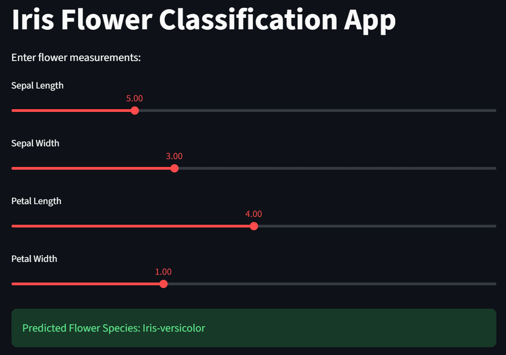

Iris Flower Classification - OIBSIP Task 1

📌 Project Overview

This project is developed as part of the Oasis Infobyte Data Science Internship.

The application predicts the species of an Iris flower using Machine Learning based on:

- Sepal Length
- Sepal Width
- Petal Length
- Petal Width

🚀 Technologies Used

- Python
- Streamlit
- Pandas
- NumPy
- Scikit-learn

🤖 Machine Learning Algorithm

- Random Forest Classifier

✨ Features

- Interactive Streamlit UI
- Real-time flower prediction
- Machine Learning based classification
- User-friendly sliders for input

▶️ How to Run

streamlit run app.py
or
python -m streamlit run app.py

📂 Dataset

Iris flower dataset containing measurements of different flower species.

📸 Project Screenshot

👨‍💻 Author

Vinay Goud Vintapuram